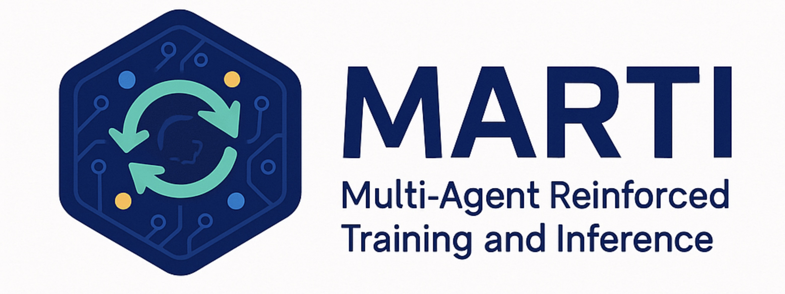
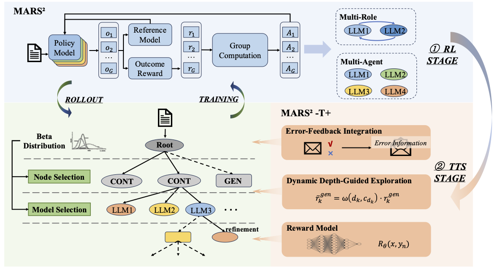
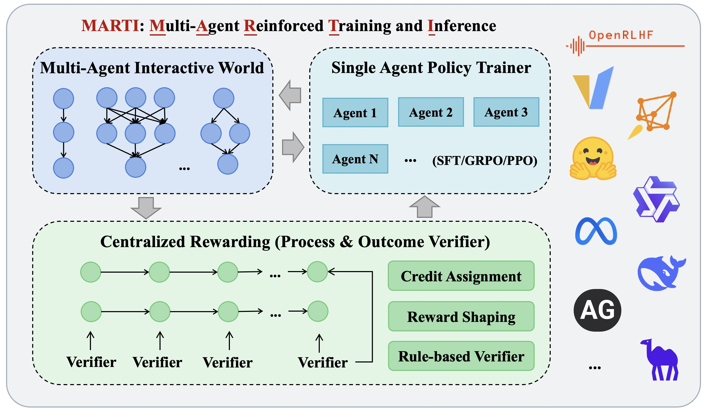
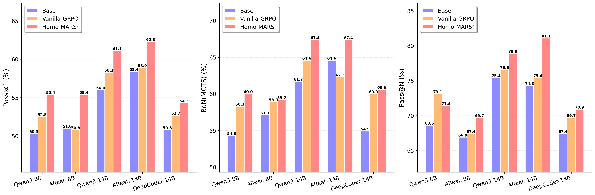
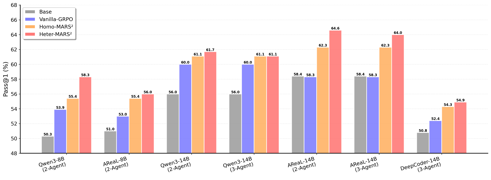

<div align="center">



# MARTI: A Framework for LLM-based Multi-Agent Reinforced Training and Inference

</div>

<h5 align="center"> If you like our project, please give us a star ⭐ on GitHub for the latest update.</h5>

<div align="center">
  
</div>

> **MARTI** is an open-source framework for training LLM-based Multi-Agent Systems (MAS) with Reinforcement Learning (RL). It enables powerful, scalable, and adaptive workflows by combining centralized multi-agent interactions with distributed policy training. MARTI supports both built-in graph-based workflows and popular third-party multi-agent frameworks.

> **MARTI-v2** extends the framework with **tree search-augmented RL** for complex reasoning tasks like code generation. By integrating multi-agent tree search, MARTI-v2 enables efficient multi-turn exploration with adaptive node expansion and refinement, allowing agents to systematically explore solution spaces and discover high-quality reasoning trajectories. The framework also incorporates advanced RL training techniques (GSPO loss for sequence-level optimization, TIS correction for vLLM sampling mismatch, dynamic data filtering, overlong buffer for token penalty) to support ultra-long sequences up to 32K tokens and heterogeneous multi-agent training.

>  We hope that MARTI not only advances reasoning capabilities beyond those of individual large language models or reasoning models, but also fosters collective intelligence as a step toward general artificial intelligence.

## 📣 Latest News
- **[2026-02-10]** 🚀🚀🚀 We release **MARTI-v2** with scaling multi-agent tree search via reinforcement learning for code generation (MARS<sup>2</sup>). Look at [🌳 MARS² - Multi-Agent Tree Search RL (New!)](#-mars²---multi-agent-tree-search-rl-new) and [Paper](https://arxiv.org/pdf/2602.07848).
- **[2026-01-25]** [MARTI](https://openreview.net/forum?id=E7jZqo0A50) was accepted by ICLR 2026, congrats to the team.
- **[2025-10-10]** We’re thrilled to see both [ReviewRL (EMNLP 2025)](https://arxiv.org/abs/2508.10308) and [CoMAS](https://arxiv.org/abs/2510.08529) being built on MARTI!
- **[2025-08-05]** We have introduced new support for Async Tool Use in Agentic RL, and Async Workflow for Multi-Agent RL. This enables more flexible and efficient RL pipelines, supporting both single-agent and multi-agent scenarios. Look at [🤝 Customised Async Step and Workflow](#-customised-async-step-and-workflow).
- **[2025-05-27]** We release the codebase of MARTI framework, welcome to have a try on LLM-based multi-agent reinforcement learning. 🤗

## Table of Contents

- [💡 Overview](#-overview)
  - [MARTI-v2: Tree Search-Augmented Multi-Agent RL (New!)](#marti-v2-tree-search-augmented-multi-agent-rl-new)
  - [MARTI](#marti)
- [🚀 Quick Start](#-quick-start)
  - [📦 Installation](#-installation)
  - [🌳 MARS² - Multi-Agent Tree Search RL (New!)](#-mars²---multi-agent-tree-search-rl-new)
    - [Single-Agent MCTS Training](#single-agent-mcts-training)
    - [Multi-Agent MCTS Training](#multi-agent-mcts-training)
  - [🤝 Customised Async Step and Workflow](#-customised-async-step-and-workflow)
    - [Single-Agent Training](#single-agent-training)
    - [Multi-Agent Training](#multi-agent-training)
- [📊 Experimental Results](#-experimental-results)
  - [MARTI-v2 (New!)](#marti-v2-new)
    - [Training Details](#training-details)
    - [Benchmark Results](#benchmark-results)
- [📚 Documentation](#-documentation)
- [👏 Acknowledge](#-acknowledge)
- [🤝 Core Contributors](#-core-contributors)
- [📬 Contact](#-contact)
- [🔬 Citation](#-citation)
- [⭐️ Star History](#️-star-history)

## 💡 Overview

### MARTI-v2: Tree Search-Augmented Multi-Agent RL (🔥New!)

MARTI-v2 extends the framework with **tree search-augmented reinforcement learning** for complex reasoning tasks like code generation. By integrating multi-agent tree search with advanced RL techniques, MARTI-v2 enables efficient multi-step exploration with adaptive node expansion and refinement, allowing agents to systematically explore solution spaces and discover high-quality reasoning trajectories.

The framework has been adapted to the latest [OpenRLHF](https://github.com/OpenRLHF/OpenRLHF) infrastructure, incorporating state-of-the-art RL training techniques for heterogeneous multi-agent training.

<p align="center">
  
</p>
<p align="center"><i>Figure 1: Overview of Core Components of MARTI-v2</i></p>

**Key Features:**

- **Multi-Agent Tree Search**: Efficient tree exploration with asynchronous multi-agent tree search, supporting code generation tasks with adaptive node expansion and refinement
- **GSPO Loss**: Sequence-level policy optimization (vs. token-level in PPO) better suited for complex reasoning tasks
- **TIS Correction**: Truncated Importance Sampling addresses distribution shift in long sequence generation, enabling stable training for ultra-long contexts and correcting vLLM sampling bias during rollout
- **Heterogeneous Multi-Agent Training**: Train different models simultaneously (e.g., Qwen3-8B + AreaL-boba-2-8B) with independent roles, training strategies, and dynamic sample filtering per agent

### MARTI

We designed the MARTI framework following the principle of centralized multi-agent interaction with distributed policy training, where all agent interactions and reward allocation occur centrally while policy training is distributed across individual agents. As illustrated in Figure 1, MARTI comprises three core modules: Multi-Agent World, Centralized Rewarding, and Single Agent Trainer.

<p align="center">
  
</p>
<p align="center"><i>Figure 2: Overview of Core Components of MARTI</i></p>

**Key Features:**
- Multi-Agent Inference + RL Training in a unified framework
- Graph-based workflows (debate, chain-of-agents, mixture-of-agents)
- Support for heterogeneous models within the same agent graph
- Built-in credit assignment and reward shaping strategies
- Support for diverse RL algorithms ([PPO](https://arxiv.org/abs/1707.06347), [GRPO](https://arxiv.org/abs/2402.03300), [REINFORCE++](https://arxiv.org/abs/2501.03262v3), [TTRL](https://arxiv.org/abs/2504.16084))
- Third-party integration with AutoGen and CAMEL (experimental)
- Advanced performance on reasoning benchmarks (e.g., AIME)

Additionally, building on single-agent RL frameworks like [OpenRLHF](https://github.com/OpenRLHF/OpenRLHF) and [verl](https://github.com/volcengine/verl), MARTI supports the vLLM v1 Engine and a Hybrid Engine to enable fast and efficient training.

## 🚀 Quick Start

### 📦 Installation

```bash
git clone https://github.com/TsinghuaC3I/MARTI.git
cd MARTI

pip install -r requirements.txt
```

Follow the setup instructions for dependencies, including OpenRLHF, Ray, and vLLM.

---

### 🌳 MARS² - Multi-Agent Tree Search RL (🔥New!)

**MARTI-v2** introduces tree search-augmented reinforcement learning training (MARS²) for complex reasoning tasks like code generation.

**Key Features:**
- **Single-agent** and **Multi-agent** MCTS training for code generation tasks
- **GSPO Loss**: Sequence-level policy optimization (better suited for complex reasoning than PPO's token-level optimization)
- **TIS Correction**: Truncated Importance Sampling to address vLLM sampling distribution mismatch
- **Dynamic Filtering**: Per-agent sample filtering for heterogeneous training
- **Overlong Buffer**: Penalty mechanism for excessively long token sequences

#### Single-Agent MCTS Training

```bash
# Minimum hardware requirement: approximately 8×80G GPUs

# Add path setting in scripts
ROOT_DIR="/path/to/MARTI"
MODEL_DIR="/path/to/models"

# Single-agent MCTS training
# See the script for more training examples
bash examples/mars2/run_train_single_mcts.sh
```

#### Multi-Agent MCTS Training

```bash
# Minimum hardware requirement: approximately 8×80G GPUs per agent

# Add path setting in scripts
ROOT_DIR="/path/to/MARTI"
MODEL_DIR="/path/to/models"

# Multi-agent MCTS training
# See the script for more training examples
bash examples/mars2/run_train_multi_mcts.sh
```

---

### 🤝 Customised Async Step and Workflow

We introduce asynchronous tool use and workflow support for both single-agent and multi-agent RL pipelines. These features make our framework more modular, efficient, and scalable for a variety of RL scenarios.

**Supported Workflows:**
- Multi-Agent Debate
- Chain-of-Agents
- Mixture-of-Agents
- Review-RL

#### Single-Agent Training

```bash
# Minimum hardware requirement: approximately 8×80G GPUs

# Add path setting in scripts
ROOT_DIR="/path/to/MARTI"
MODEL_DIR="/path/to/models"

# Train asynchronous multi-turn code RL
bash examples/single-agent/run_train_code_async.sh

# Train asynchronous multi-turn math RL
bash examples/single-agent/run_train_math_async.sh
```

#### Multi-Agent Training

```bash
# Minimum hardware requirement: approximately 8×80G GPUs per agent

# Add path setting in scripts
ROOT_DIR="/path/to/MARTI"
MODEL_DIR="/path/to/models"

# Mixture-of-Agents
bash examples/multi-agent/run_train_chain.sh

# Multi-agent Debate
bash examples/multi-agent/run_train_mad.sh

# Chain-of-agents (MathChat)
bash examples/multi-agent/run_train_mathchat.sh

# Review-RL
bash examples/reviewrl/run_train_reviewrl_async.sh
```

---


## 📊 Experimental Results

### MARTI-v2 (New!)

#### Training Details

We employ the MARTI-v2 framework to train reasoning models, specifically `Qwen3-8B`, `Qwen3-14B`, `AreaL-boba-2-8B`, `AreaL-boba-2-14B`, and `DeepCoder-14B`. For multi-agent reinforcement learning, we employ a cluster configuration consisting of 3 nodes, each equipped with 8 H200 GPUs, allocating one full node per agent.

#### Benchmark Results

We evaluate MARTI-v2 on the LCB code generation benchmark under both single-agent and multi-agent settings compared to baseline methods. As shown in Figure 3 and Figure 4, our experiments demonstrate that:

- **Single-agent MCTS achieves faster convergence**: The single-agent setting outperforms Vanilla GRPO baseline across all base models, with Pass@1 improvements up to 4.6% and Pass@1(MCTS) improvements up to 5.1%, exhibiting faster early-stage convergence and stronger deep optimization capabilities.
- **Multi-agent MCTS breaks performance bottlenecks**: The multi-agent setting maintains policy diversity and effectively addresses the performance saturation issue in later training stages. For Qwen3-8B, multi-agent training achieves 8.0% improvement over the base model, 4.4% over Vanilla GRPO, and 2.9% over single-agent peak performance.
- **Enhanced system-level collaboration**: With 14B-scale heterogeneous agent teams, multi-agent training achieves 71.2% Pass@1(MCTS), with consistent improvements in Pass@N metrics, validating comprehensive enhancements in collaborative problem-solving capabilities.

<p align="center">
  
</p>
<p align="center"><i>Figure 3: Experimental results of single-agent MCTS and baseline methods on LCB benchmarks</i></p>

<p align="center">
  
</p>
<p align="center"><i>Figure 4: Pass@1 results of multi-agent MCTS and baseline methods on LCB benchmarks</i></p>


## 📚 Documentation

- [Overview of MARTI](./docs/1-Overview-Of-MARTI.md)
- [Workflows Integration](./docs/2-Workflows-Integration.md)
- [Reward and Training](./docs/3-Reward-And-Training.md)
- [Experiments of MARTI](./docs/4-Experiments-Of-MARTI.md)
- [MARTI-v2 Technical Details](http://arxiv.org/abs/2602.07848)

## 👏 Acknowledge

MARTI is developed primarily based on [OpenRLHF](https://github.com/OpenRLHF/OpenRLHF). We would like to express our gratitude to the developers of [OpenRLHF](https://github.com/OpenRLHF/OpenRLHF), as well as to the teams behind [vLLM](https://github.com/vllm-project/vllm), [Ray](https://github.com/ray-project/ray), [DeepSpeed](https://github.com/deepspeedai/DeepSpeed), and [TreeQuest](https://github.com/treequest/treequest) for their invaluable contributions.

## 🤝 Core Contributors   

- **Project Lead:** [Kaiyan Zhang](https://iseesaw.github.io/), [Biqing Qi](https://biqing-qi.github.io/)
- **Agent Group:** [Shijie Wang](https://github.com/shijiewang28), [Pengfei Li](https://github.com/lpf992), [Kiafeng Liu](https://github.com/Semonlkf), [Yang Liu](https://github.com/StrongWindBlows), [Yikun Fu](https://github.com/JiaranI), [Xiaowei Sun](https://github.com/xwsun01), [Kai Tian](https://github.com/XiaoTiank), [Kaiyan Zhang](https://iseesaw.github.io/)
- **RL Group:** [Pengfei Li](https://github.com/lpf992), [Shijie Wang](https://github.com/shijiewang28), [Yikun Fu](https://github.com/JiaranI), [Fangyuan Li](https://github.com/lfy-123), [Kaiyan Zhang](https://iseesaw.github.io/)

For the full list of contributors, please refer to the author list in the citation. We are also deeply grateful to everyone who engaged in discussions and provided valuable feedback throughout the development of this project.

## 📬 Contact

For issues or inquiries: 
- Kaiyan Zhang, Tsinghua University (zhang-ky22@mails.tsinghua.edu.cn)
- Biqing Qi, Shanghai AI Lab (qibiqing@pjlab.org.cn)

## 🔬 Citation

If you use MARTI in your research, please cite the project:

```bibtex
@misc{marti2025,
  title={MARTI: A Framework for Multi-Agent LLM Systems Reinforced Training and Inference},
  author={Kaiyan Zhang and Runze Liu and Xuekai Zhu and Kai Tian and Sihang Zeng and Guoli Jia and Yuchen Fan and Xingtai Lv and Yuxin Zuo and Che Jiang and Ziyang Liu and Jianyu Wang and Yuru Wang and Ruotong Zhao and Ermo Hua and Yibo Wang and Shijie Wang and Junqi Gao and Xinwei Long and Youbang Sun and Zhiyuan Ma and Ganqu Cui and Lei Bai and Ning Ding and Biqing Qi and Bowen Zhou},
  year={2025},
  institution={Tsinghua University and Shanghai AI Lab},
  url={https://github.com/TsinghuaC3I/MARTI}
}

@misc{marti2026,
  title={MARTI-MARS$^2$: Scaling Multi-Agent Self-Search via Reinforcement Learning for Code Generation},
  author={Shijie Wang and Pengfei Li and Yikun Fu and Kaifeng Liu and Fangyuan Li and Yang Liu and Xiaowei Sun and Zonglin Li and Siyao Zhao and Jian Zhao and Kai Tian and Dong Li and Junqi Gao and Yutong Zhang and Yiqun Chen and Yuqiang Li and Zoe Li and Weinan Zhang and Peng Ye and Shuyue Hu and Lei Bai and Bowen Zhou and Kaiyan Zhang and Biqing Qi},
  year={2026},
  institution={Shanghai AI Lab and Tsinghua University},
  url={https://github.com/TsinghuaC3I/MARTI}
}

```

## ⭐️ Star History

[](https://www.star-history.com/#TsinghuaC3I/MARTI&Date)


---

<p align="center">
  <i>MARTI © 2025 Tsinghua University & Shanghai AI Lab. All rights reserved.</i>
</p>
