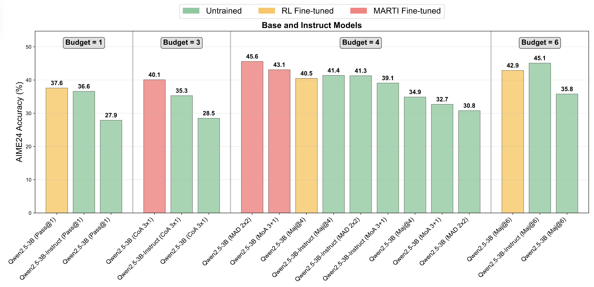
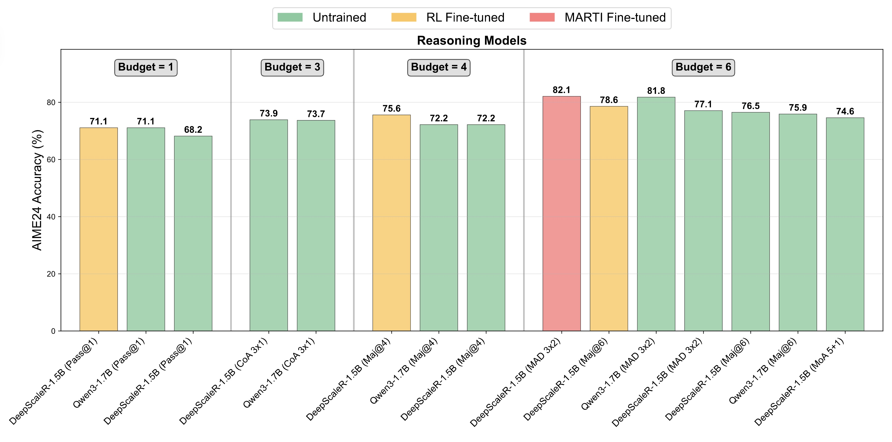
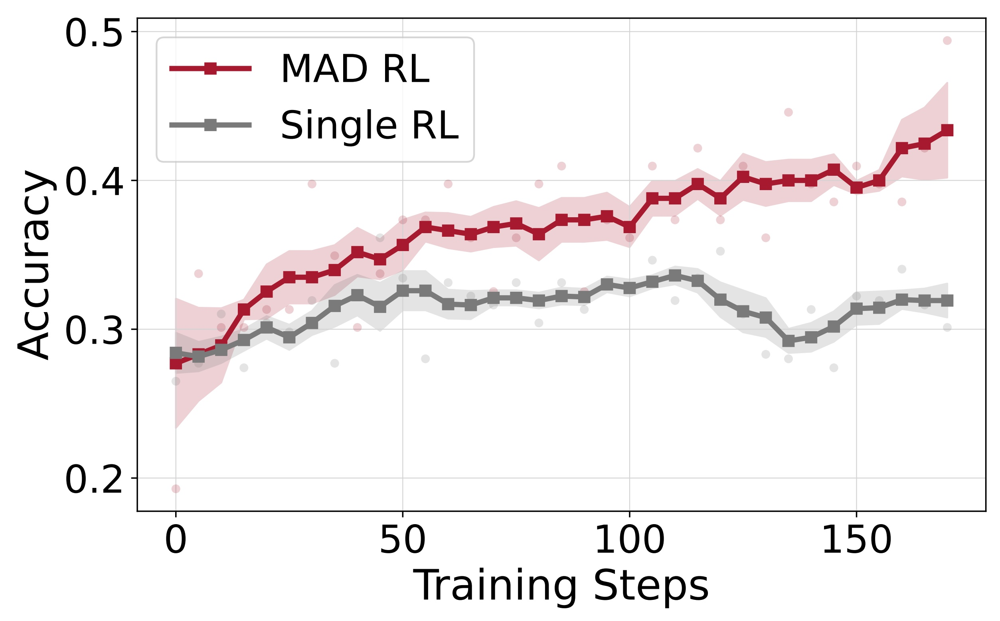
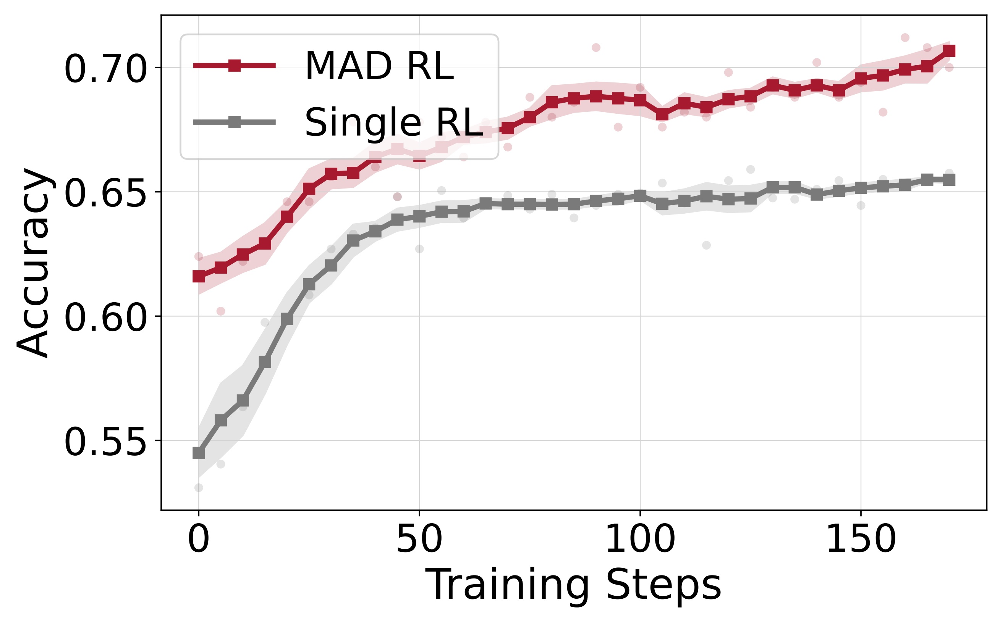
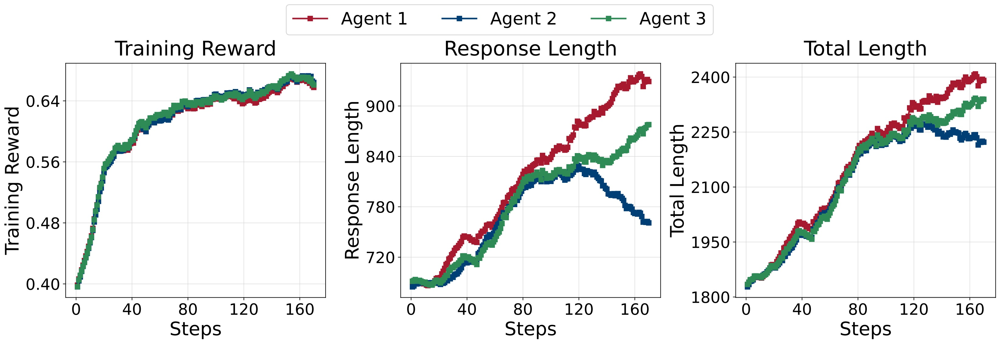
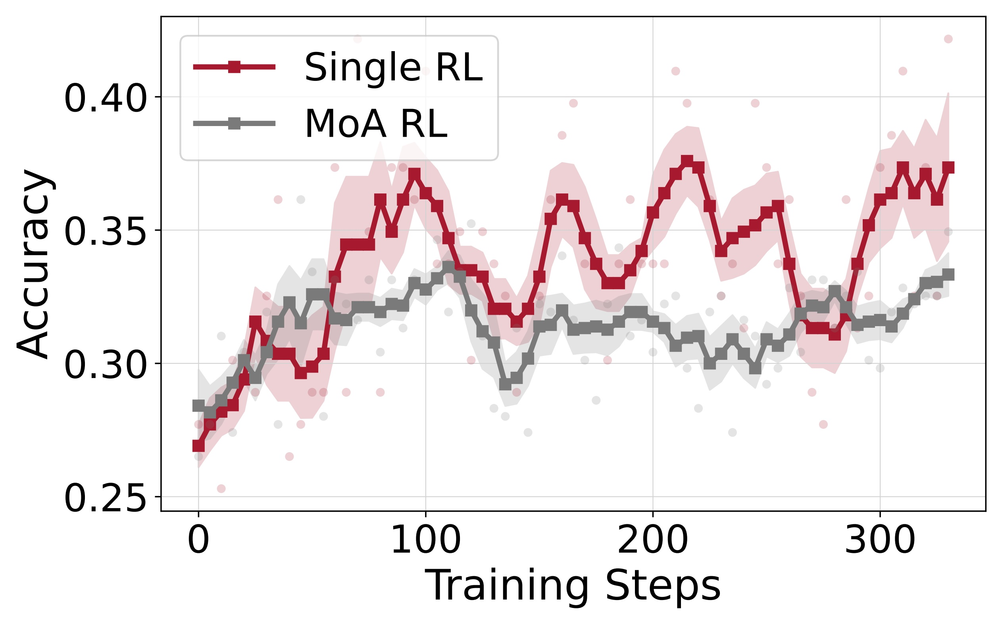
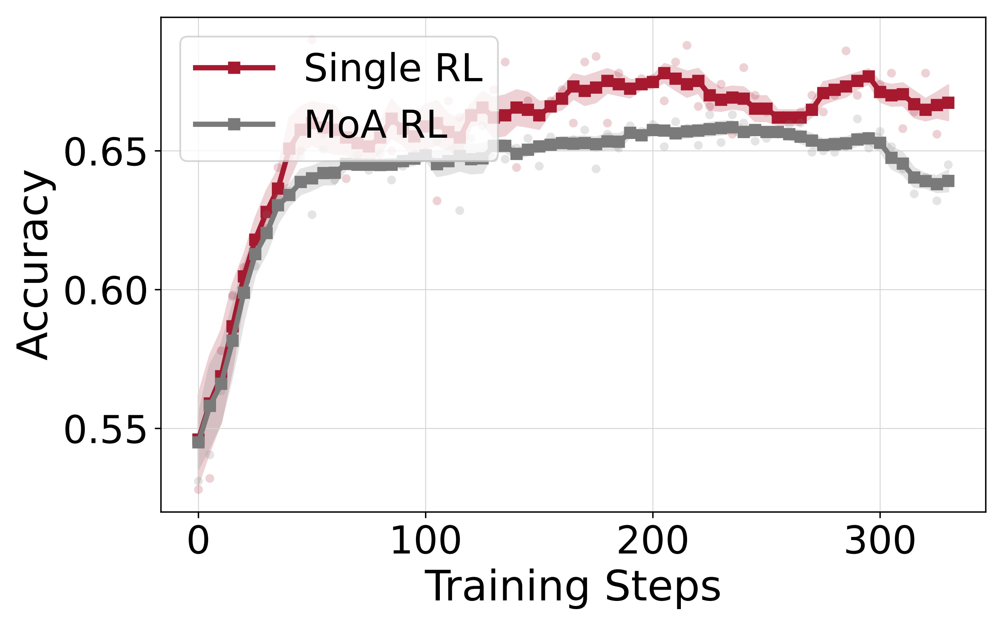
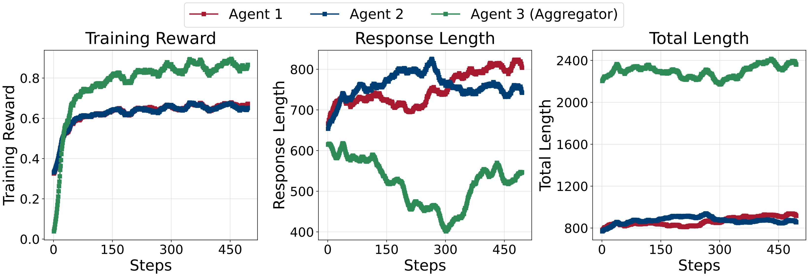

# Training Details

We employ the MARTI framework to train both base and reasoning models, specifically `Qwen2.5-3B` and `DeepScaleR-1.5B-Preview`. For `Qwen2.5-3B`, we implement DeepSeek-R1 zero-like reinforcement learning training using Level 3-5 samples from the MATH dataset. The `DeepScaleR-1.5B-Preview` model, which exhibits strong inherent reasoning capabilities but presents training challenges, undergoes [Test-Time Reinforcement Learning (TTRL)](https://github.com/PRIME-RL/TTRL) adaptation on AIME benchmark data. For multi-agent reinforcement learning, we employ a cluster configuration consisting of 3 nodes, each equipped with 8 A800 80GB GPUs, allocating one full node per agent.

# Benchmark Results
We compare non-reasoning and reasoning models under various configurations and show that majority voting consistently outperforms multi-agent workflows when trained conventionally. This reflects known limitations of current LLM-based agent systems, such as poor role adherence and ineffective inter-agent communication.

To address this, MARTI enhances model reasoning through structured agent interactions. As shown in Figure 3 and Figure 4, our experiments show that:

- MARTI-trained base models outperform standard RL setups and rival instructed models.
- Large reasoning models trained with MARTI using TTRL achieve state-of-the-art results on challenging tasks (e.g., 66.7 AIME score with Multi-Agent Debates).
- Multi-agent RL consistently surpasses single-agent systems in performance under the same compute budget.

  

<i>Figure 3: Average scores of Qwen2.5-3B base and instruct models under different budget and settings</i>

  

<i>Figure 4: Average scores of reasoning models under different budget and settings</i>

#### Training Dynamics

##### Multi-Agents Debate
We conduct multi-agent debate training with `Qwen2.5-3B` The `Qwen2.5-3B` model is trained using REINFORCE++ on Level 3 to 5 samples from the MATH-500 dataset.

  
  

<i>Figure 5: Accuracy of MAD (Qwen2.5-3B, MATH) on AMC and MATH</i>

  

<i>Figure 6: Training Dynamics of MAD (Qwen2.5-3B, MATH)</i>

##### Mixture-of-Agents
We evaluate a mixture-of-agents approach using the `Qwen2.5-3B` model, trained on Levels 3 through 5 of the MATH-500 training dataset.

  
  

<i>Figure 7: Accuracy of MoA (Qwen2.5-3B, MATH) on AMC and MATH</i>

  

<i>Figure 8: Training Dynamics of MoA (Qwen2.5-3B, MATH)</i>
